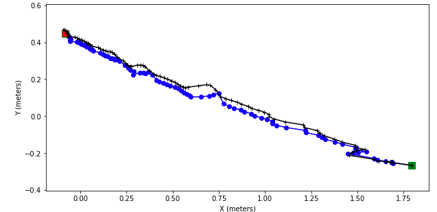
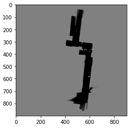
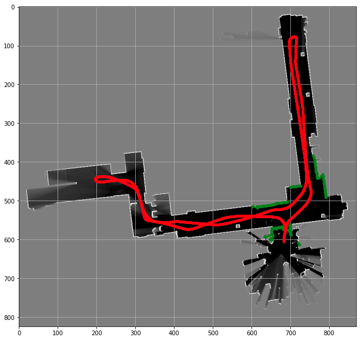
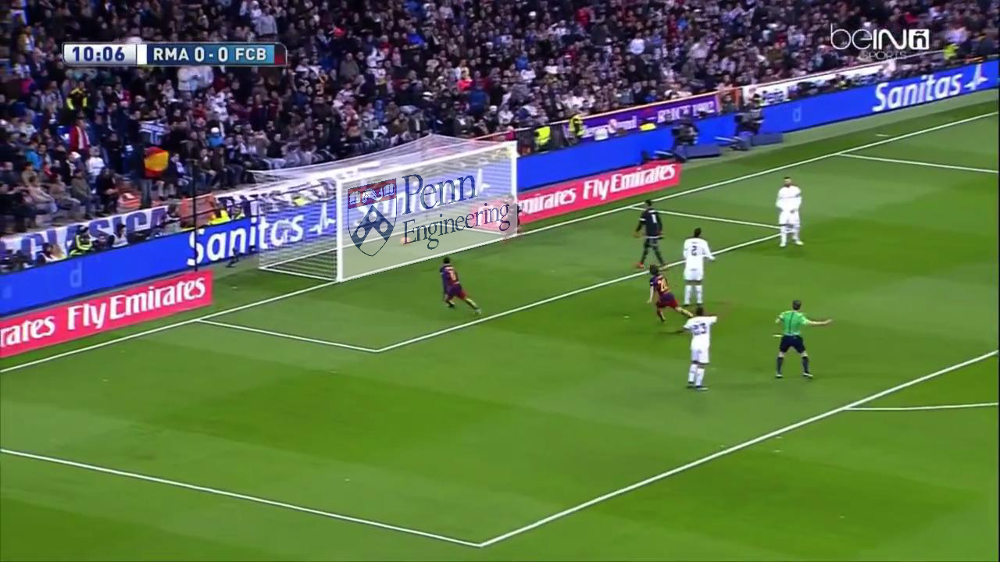
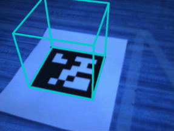
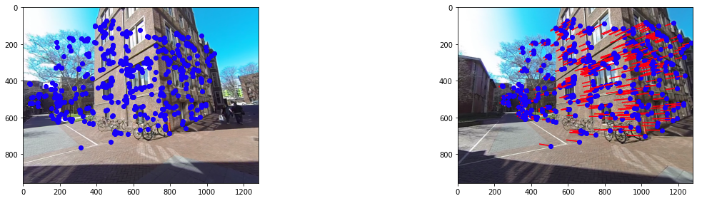

# Robotics-Coursework
Python implementation of Robotics Coursework

## Estimation and Learning  
  ### Week2: Kalman Filter Tracking
   </img>

  ### Week3: Occupancy Grid Mapping
   </img>
  
  ### Week4: Particle Filter Localization
   </img>

## Perception
  ### Week2: Projective Transformation
   </img>
  ### Week3: 6D Pose Prediction
   </img>
  #### Week4: Structure from Motion
   </img>
